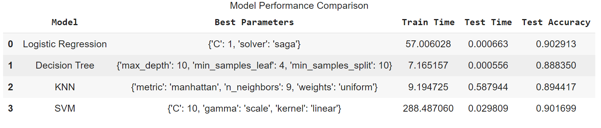
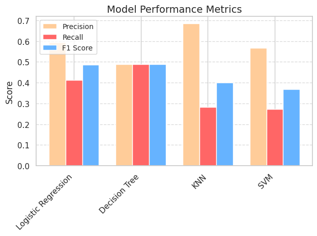

# Practical Application Assignment 11.1: 

Comparing-Classifiers

## Location of Jupyter Notebook:
The corresponding Jupyter Notebook that was used to analyze the dataset and create the following charts is located in Github at the following location:

https://github.com/andrespineda/Comparing-Classifiers

## Background

As part of the UC Berkeley Professional Certificate in Machine Learning
and Artificial Intelligence (UC Berkeley, 2022), this assignment is the
last Practical Assignment designed to test our new skills. We are to use the Cross Industry Standard Process for Data Mining (CRISP-DM) method
(Schröer, et al, 2021) of data analysis, see Figure 1 below, on a
dataset of car prices.

Figure 1: The Cross Industry Standard Process for Data Mining (CRISP-DM)

**CRISP-DM**

The CRISP-DM (Cross-Industry Standard Process for Data Mining) approach
to data analysis involves six major steps as outlined below:

- Understanding the Business: This initial step involves conducting an
  in-depth analysis of the business objectives and needs. It includes
  assessing the current situation, defining goals based on insights, and
  setting up a plan to proceed.

- Understanding the Data: In this phase, data is collected from various
  sources, its format and type are determined, and the data is profiled.
  Tasks include exploring the data, describing it, and ensuring its
  quality, accuracy, and validity.

- Data Preparation: Careful selection, cleansing, construction, and
  formatting of the data are carried out in this step. The data is
  organized for modeling, and information exploration is conducted to
  identify patterns aligned with business insights.

- Modeling: The modeling phase involves selecting modeling techniques,
  generating test scenarios for validation, building various models, and
  assessing them to ensure alignment with business objectives

- Evaluation: During this phase, the results of the models are evaluated
  against business intentions. Multiple models are assessed to determine
  which one best meets the project's goals.

- Deployment/Communication: The final step involves presenting the
  gathered information in a usable manner to stakeholders according to
  their expectations and business requirements. This phase may vary in
  complexity based on numerous factors.

## Scope of this Assignment

As this is the third Module that involves a practical application of the
data analysis, this assignment only covers the first three sections of
the CRISP-DM methodology: Understanding the Business, Understanding the Data, Data Preparation, and Modeling.

## Understanding the Business
Portuguese Retail Bank is a bank in Portugal that conducted a data-driven approach to predict the success of telemarketing calls for selling bank long-term deposits. The bank collected data from 2008 to 2013, including the effects of the recent financial crisis, and analyzed various features related to bank clients, products, and socio-economic attributes.

**Business Objectives**
The business objective is to develop an efficient direct marketing campaign that that successfully subscribes a customer to a term deposit with the bank.
When a customer subscribes to a term deposit in banking, it means they have opened a deposit account where their money is locked for a fixed period of time (term) in exchange for earning a higher interest rate than a regular savings account.
General undirected campaigns have a low success rate and by evalauting the customer's profile and the results of the campaign, the bank can focus on targeting specific customers that are more likely to subscribe.

## Data Understanding

Various tools and resources are used for conducting the Data
Understanding step.

**Dataset**

This dataset is based on "Bank Marketing" UCI dataset (please check the description at: http://archive.ics.uci.edu/ml/datasets/Bank+Marketing). The data is enriched by the addition of five new social and economic features/attributes (national wide indicators from a ~10M population country), published by the Banco de Portugal and publicly available at: https://www.bportugal.pt/estatisticasweb. This dataset is almost identical to the one used in [Moro et al., 2014] 

Input variables:

**Bank client data:****
1 - age (numeric)
2 - job : type of job (categorical: 'admin.','blue-collar','entrepreneur','housemaid','management','retired','self-employed','services','student','technician','unemployed','unknown')
3 - marital : marital status (categorical: 'divorced','married','single','unknown'; note: 'divorced' means divorced or widowed)
4 - education (categorical: 'basic.4y','basic.6y','basic.9y','high.school','illiterate','professional.course','university.degree','unknown')
5 - default: has credit in default? (categorical: 'no','yes','unknown')
6 - housing: has housing loan? (categorical: 'no','yes','unknown')
7 - loan: has personal loan? (categorical: 'no','yes','unknown')

**Related with the last contact of the current campaign:**
8 - contact: contact communication type (categorical: 'cellular','telephone')
9 - month: last contact month of year (categorical: 'jan', 'feb', 'mar', ..., 'nov', 'dec')
10 - day_of_week: last contact day of the week (categorical: 'mon','tue','wed','thu','fri')
11 - duration: last contact duration, in seconds (numeric). Important note: this attribute highly affects the output target (e.g., if duration=0 then y='no'). Yet, the duration is not known before a call is performed. Also, after the end of the call y is obviously known. Thus, this input should only be included for benchmark purposes and should be discarded if the intention is to have a realistic predictive model.

**Other attributes:**
12 - campaign: number of contacts performed during this campaign and for this client (numeric, includes last contact)
13 - pdays: number of days that passed by after the client was last contacted from a previous campaign (numeric; 999 means client was not previously contacted)
14 - previous: number of contacts performed before this campaign and for this client (numeric)
15 - poutcome: outcome of the previous marketing campaign (categorical: 'failure','nonexistent','success')

**Social and economic context attributes**
16 - emp.var.rate: employment variation rate - quarterly indicator (numeric)
17 - cons.price.idx: consumer price index - monthly indicator (numeric)
18 - cons.conf.idx: consumer confidence index - monthly indicator (numeric)
19 - euribor3m: euribor 3 month rate - daily indicator (numeric)
20 - nr.employed: number of employees - quarterly indicator (numeric)

**Output variable (desired target):**
21 - y - has the client subscribed a term deposit? (binary: 'yes','no')

## Modeling

### Baseline Model
The first model is a simple one that will be used as a reference for accuracy in comparison with subsequent more complex models.

For the baseline model a Logistic Regression classifier was developed. 
The result was as follows:

**Baseline Accuracy: 0.90**

The more complex models included:
* Logical Regression
* KNN
* Decision Tree
* SVM

A GridSearchCV was performed using the following hyperparameters:

param_grids = {
    'Logistic Regression': {
        'C': [0.01, 0.1, 1, 10, 100],
        'solver': ['liblinear', 'saga']
    },
    

    'Decision Tree': {
        'max_depth': [1, 10, 20, 30, 40, 50],
        'min_samples_split': [2, 5, 10],
        'min_samples_leaf': [1, 2, 4]
    },
    

    'KNN': {
        'n_neighbors': [3, 5, 7, 9],
        'weights': ['uniform', 'distance'],
        'metric': ['euclidean', 'manhattan']
    },
    

    'SVM': {
        'C': [0.1, 1, 10, 100],
        'kernel': ['linear', 'rbf', 'poly'],
        'gamma': ['scale', 'auto']
    }
    

 ### Evaluation of Model Scores
 

The performance chart provides a comprehensive comparison of four different classification models: Logistic Regression, Decision Tree, K-Nearest Neighbors (KNN), and Support Vector Machine (SVM). Here is an evaluation and insights based on the provided metrics:

**Logistic Regression:**
* Best Parameters: {'C': 1, 'solver': 'saga'}
* Train Time: 57.006028 seconds
* Test Time: 0.000663 seconds
* Test Accuracy: 0.902913
* Observations: Logistic Regression has the fastest test time and a relatively low train time. It achieves a high test accuracy of 0.902913, making it a strong candidate for applications where quick predictions are essential.

**Decision Tree:**
* Best Parameters: {'max_depth': 10, 'min_samples_leaf': 4, 'min_samples_split': 10}
* Train Time: 7.165157 seconds
* Test Time: 0.000556 seconds
* Test Accuracy: 0.888350
* Observations: The Decision Tree model has the fastest train and test times among all models. However, its test accuracy is the lowest at 0.888350, indicating it may not generalize as well as the other models.

**K-Nearest Neighbors (KNN):**
* Best Parameters: {'metric': 'manhattan', 'n_neighbors': 9, 'weights': 'uniform'}
* Train Time: 9.194725 seconds
* Test Time: 0.587944 seconds
* Test Accuracy: 0.894417
* Observations: KNN has the longest test time, which can be a drawback for real-time applications. Its test accuracy is 0.894417, which is lower than Logistic Regression and SVM but higher than the Decision Tree. The training time is moderate.

**Support Vector Machine (SVM):**
* Best Parameters: {'C': 10, 'gamma': 'scale', 'kernel': 'linear'}
* Train Time: 288.487060 seconds
* Test Time: 0.029809 seconds
* Test Accuracy: 0.901699
* Observations: SVM has the highest train time, making it less suitable for scenarios where model training needs to be quick. However, it has a high test accuracy of 0.901699 and a relatively low test time.

**Insights**

**Trade-off Between Training Time and Accuracy:**
Logistic Regression and SVM both achieve high test accuracies (0.902913 and 0.901699, respectively). However, Logistic Regression has a significantly lower train time compared to SVM, making it more efficient for training.

**Real-time Prediction Suitability:**
Logistic Regression and Decision Tree models are more suitable for real-time predictions due to their extremely low test times. KNN, despite having a decent accuracy, has a high test time, which may not be ideal for real-time applications.

**Model Complexity and Overfitting:**
The Decision Tree model, with its lower accuracy, might be overfitting the training data or not capturing the complexity of the data as well as the other models. This suggests a need for further tuning or considering ensemble methods like Random Forests.

**Parameter Tuning:**
The best parameters for each model indicate the importance of hyperparameter tuning. For instance, the 'manhattan' metric and 9 neighbors for KNN, and the 'scale' kernel for SVM, highlight how different settings can impact model performance.

## Summary
Each model has its strengths and weaknesses. Logistic Regression stands out for its balance of high accuracy and low training and test times, making it a robust choice for many applications. SVM, while accurate, is computationally expensive to train. Decision Tree is the fastest to train and test but has the lowest accuracy, and KNN, while accurate, is slow in making predictions. The choice of model should be guided by the specific requirements of the application, such as the need for real-time predictions or the computational resources available for training.

### Precision, Recall, and F1 Score

## Precision, Recall, and F1 Score

**Logistic Regression:**
* Precision: 0.593750
* Recall: 0.413043
* F1 Score: 0.487179
* Observations: Logistic Regression has a moderate precision and recall, resulting in a balanced F1 score. It indicates a good balance between identifying positive instances and minimizing false positives.

**Decision Tree:**
* Precision: 0.421569
* Recall: 0.467391
* F1 Score: 0.443299
* Observations: The Decision Tree model has the lowest precision but a relatively higher recall compared to other models. This suggests it is better at identifying positive instances but at the cost of more false positives.

**K-Nearest Neighbors (KNN):**
* Precision: 0.684211
* Recall: 0.282609
* F1 Score: 0.400000
* Observations: KNN has the highest precision, indicating it is very accurate when it predicts a positive instance. However, its recall is the lowest, meaning it misses many positive instances, leading to a lower F1 score.

**Support Vector Machine (SVM):**
* Precision: 0.568182
* Recall: 0.271739
* F1 Score: 0.367647
* Observations: SVM has a moderate precision but the lowest recall, similar to KNN. This results in a lower F1 score, indicating it is less balanced in terms of precision and recall.

**Insights**
**Precision vs. Recall Trade-off:**
KNN has the highest precision but the lowest recall, indicating it is very accurate when it predicts a positive instance but misses many positives. Logistic Regression offers a better balance between precision and recall.

**Model Efficiency:**
Logistic Regression and Decision Tree models are more efficient for real-time predictions due to their low test times. Logistic Regression also has the highest test accuracy, making it a robust choice.

**Model Complexity:**
SVM, while accurate, is computationally expensive to train. Decision Tree, despite being the fastest to train and test, has the lowest accuracy, suggesting it may not capture the data complexity as well as other models.

**Overall Performance:**
Logistic Regression stands out for its balance of high accuracy, moderate precision and recall, and low training and test times. It is a strong candidate for applications requiring both efficiency and accuracy.

**Conclusion**
Each model has its strengths and weaknesses. Logistic Regression is the most balanced in terms of accuracy, precision, recall, and efficiency. KNN, while having the highest precision, suffers from low recall and high test time. Decision Tree is the fastest but least accurate, and SVM, though accurate, is computationally intensive. The choice of model should be guided by the specific requirements of the application, such as the need for real-time predictions or the computational resources available.

## Next Steps

The next steps in this process will be the Deployment/Communication steps in the CRISP-DM methodology. These steps will require skills that we currently have not studied, but we are looking forward to learning these techniques.

## References

[Moro et al., 2014] S. Moro, P. Cortez and P. Rita. A Data-Driven Approach to Predict the Success of Bank Telemarketing. Decision Support Systems, In press, http://dx.doi.org/10.1016/j.dss.2014.03.001

Muller, D. (2017, November 14). How equipment choices affect a car’s resale value. Weighing Your Options: How Equipment Choices Affect a Car’s Resale Value. https://www.caranddriver.com/news/a15338786/weighing-your-options-how-equipment-choices-affect-a-cars-resale-value/

Schröer, Christoph & Kruse, Felix & Marx Gómez, Jorge. (2021). A
Systematic Literature Review on Applying CRISP-DM Process Model.
Procedia Computer Science. 181. 526-534. 10.1016/j.procs.2021.01.199.

UC Berkeley. (August 30, 2022). “UC Berkeley Professional Certificate in
Machine Learning and Artificial Intelligence”. UC Berkeley.
https://em-executive.berkeley.edu/professional-certificate-machine-learning-artificial-intelligence

